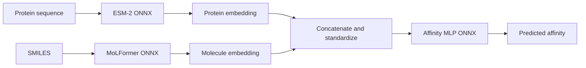
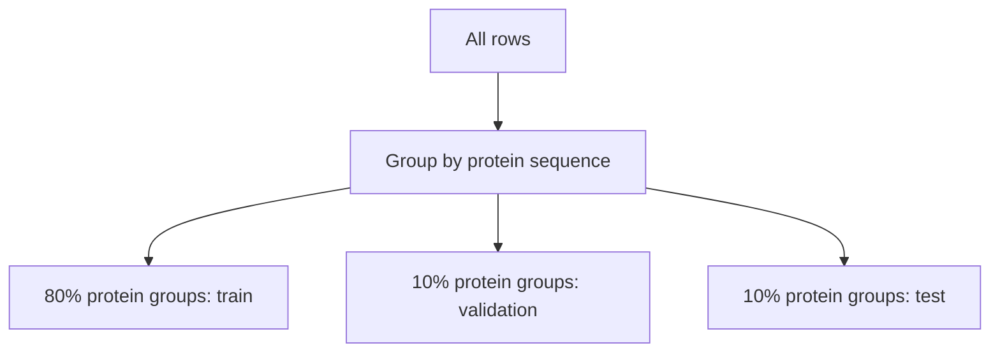

<div align="center">

# 🧬 Protein-Compound Affinity Prediction

### ESM-2 ONNX + MoLFormer ONNX + Affinity ONNX


Protein-compound affinity prediction using frozen scientific encoders and a small trainable
regression head.

</div>

## Project

The model receives:

- a protein amino-acid sequence;
- a molecule represented as a SMILES string.

Each input is encoded independently. The two embeddings are concatenated, standardized with
training-set statistics, and passed through an MLP that predicts the affinity label.



Deployment runs three ONNX graphs. PyTorch is not needed in the local application or Hugging Face
Space.

## Encoder Profiles

The notebooks expose one setting:

```python
ENCODER_PROFILE = "lightweight"  # lightweight or legacy
```

The lightweight profile is the default because it can be exported, downloaded and served within
normal notebook and CPU Space limits.

| Profile | Protein encoder | Molecule encoder | Intended use |
|---|---|---|---|
| `lightweight` | `facebook/esm2_t12_35M_UR50D` | `ibm-research/MoLFormer-XL-both-10pct` | Default training and deployment |
| `legacy` | `GreatCaptainNemo/ProLLaMA` | `DongkiKim/Mol-Llama-3.1-8B-Instruct` | Optional large-model experiment |

Embedding datasets and affinity heads from different profiles are not interchangeable. The exact
model IDs, pooling settings and maximum lengths are stored in `dataset_metadata.json` and the
trained model's `metadata.json`.

## Default Models

### Protein: ESM-2 35M

[facebook/esm2_t12_35M_UR50D](https://huggingface.co/facebook/esm2_t12_35M_UR50D)
is a 12-layer ESM-2 transformer with roughly 35 million parameters.

- Backbone: bidirectional protein Transformer.
- Objective: masked amino-acid language modeling.
- Training sources described by the model card: UniRef90 and UniRef50 protein clusters.
- Maximum content length: 1,022 residues, plus tokenizer special tokens.
- Exported representation: mean of the final hidden states over amino-acid tokens; padding and
  special tokens are excluded.
- ONNX output: one fixed-size protein embedding.

The originally considered
[`nvidia/esm2_t12_35M_UR50D`](https://huggingface.co/nvidia/esm2_t12_35M_UR50D)
checkpoint uses Transformer Engine custom CUDA layers. It requires a matching CUDA ABI and is not
a portable source for standard ONNX export. The default therefore uses the standard Hugging Face
ESM-2 checkpoint with the same 12-layer/35M model scale.

Paper:
[Evolutionary-scale prediction of atomic-level protein structure with a language model](https://www.science.org/doi/10.1126/science.ade2574).

### Molecule: MoLFormer XL 10%

[ibm-research/MoLFormer-XL-both-10pct](https://huggingface.co/ibm-research/MoLFormer-XL-both-10pct)
has roughly 46.8 million parameters.

- Backbone: linear-attention Transformer with rotary positional embeddings.
- Objective: masked language modeling over canonicalized SMILES.
- Pretraining data: 10% of ZINC15 and 10% of PubChem.
- Training filter: molecules longer than 202 tokens were excluded.
- Exported representation: the model's official `pooler_output`.
- ONNX output: one fixed-size molecule embedding.

Paper:
[Large-scale chemical language representations capture molecular structure and properties](https://www.nature.com/articles/s42256-022-00580-7).

## Optional Legacy Models

The original workflow remains available.

### ProLLaMA

- Model: [GreatCaptainNemo/ProLLaMA](https://huggingface.co/GreatCaptainNemo/ProLLaMA)
- Backbone: Llama-family 7B decoder adapted to protein sequences.
- Representation: attention-mask mean of the final decoder hidden state.
- Prompt: `[Determine superfamily] Seq=<{sequence}>`.
- Paper: [ProLLaMA](https://arxiv.org/abs/2402.16445).

### Mol-LLaMA

- Model: [DongkiKim/Mol-Llama-3.1-8B-Instruct](https://huggingface.co/DongkiKim/Mol-Llama-3.1-8B-Instruct)
- Molecular path: MoleculeSTM, Uni-Mol, modality blending and Q-Former.
- Representation: mean of Q-Former query tokens.
- Paper: [Mol-LLaMA](https://arxiv.org/abs/2502.13449).

The 8B text decoder is not included in the molecular embedding graph. Even so, the legacy profile
has much higher export and runtime requirements than the default pair.

## Notebook Workflow

Run the notebooks in order. Artifacts move between stages through Hugging Face repositories.

### 1. Export Encoders

Open [01_export_llms_to_onnx.ipynb](notebooks/01_export_llms_to_onnx.ipynb).

The lightweight export works on CPU or GPU and does not require Transformer Engine. A GPU reduces
export and parity-check time. The resulting ONNX graphs can run with ONNX Runtime on CPU.

The default profile:

1. downloads ESM-2 and MoLFormer;
2. removes their masked-language-model prediction heads from the exported path;
3. exports pooled embedding graphs;
4. checks PyTorch/ONNX numerical parity;
5. validates external ONNX files;
6. optionally clears the existing Hugging Face model repositories;
7. uploads both complete encoder folders.

Default repositories:

```text
your-name/esm2-affinity-onnx
your-name/molformer-affinity-onnx
```

Set `ENCODER_PROFILE = "legacy"` to export:

```text
your-name/prollama-affinity-onnx
your-name/mol-llama-affinity-onnx
```

`CLEAN_REPOSITORIES = True` deletes and recreates the selected remote repositories before upload.
This also removes their previous commit history.

### 2. Build Embedding Dataset

Open [02_build_embedding_dataset.ipynb](notebooks/02_build_embedding_dataset.ipynb).

This notebook:

1. downloads the selected encoder repositories;
2. downloads and validates the competition CSV;
3. detects the available ONNX Runtime CPU or CUDA provider;
4. embeds each unique protein and molecule;
5. writes resumable molecule shards;
6. creates cold-protein train, validation and test splits;
7. uploads CSV rows and compressed feature matrices.

Default repository:

```text
your-name/protein-compound-affinity-esm2-molformer
```

Default extraction settings:

```text
ESM-2 maximum length: 1024 tokens
ESM-2 batch size: 16
MoLFormer maximum length: 202 tokens
MoLFormer batch size: 32
Molecule shard size: 1000
```

Reduce batch sizes if GPU or system memory is limited. Existing molecule shards are skipped when
the extraction command is restarted.

### 3. Train, Validate and Export

Open [03_train_validate_export.ipynb](notebooks/03_train_validate_export.ipynb).

The notebook:

1. downloads the profile-specific embedding dataset;
2. fits normalization using training rows only;
3. trains the fusion MLP;
4. selects the best validation-RMSE checkpoint;
5. evaluates the held-out test split;
6. reports MAE, RMSE, R² and Pearson correlation;
7. exports and validates the affinity head as ONNX;
8. uploads the final model.

Default repository:

```text
your-name/protein-compound-affinity-esm2-molformer-onnx
```

## Data Splitting

The default split is cold protein. A protein sequence appears in only one split, which avoids the
same protein leaking into training and testing.



## Local Inference

Install:

```bash
python -m venv .venv
source .venv/bin/activate
pip install -e ".[space]"
```

Windows PowerShell activation:

```powershell
.venv\Scripts\Activate.ps1
pip install -e ".[space]"
```

Run:

```bash
python app.py \
  --protein-encoder ./models/esm2-affinity-onnx \
  --molecule-encoder ./models/molformer-affinity-onnx \
  --affinity ./models/protein-compound-affinity-esm2-molformer-onnx
```

The application provides affinity inference, protein composition summaries, molecule descriptors,
2D molecule rendering, generated molecule conformers, and uploaded PDB visualization.

## Hugging Face Space

The repository includes a deployment script that packages `src/affinity` into the Docker build
context, creates the Space, configures variables and uploads the application.

```bash
export HF_TOKEN=hf_your_write_token

python scripts/deploy_hf_space.py \
  --space your-name/protein-compound-affinity \
  --protein-repo your-name/esm2-affinity-onnx \
  --molecule-repo your-name/molformer-affinity-onnx \
  --affinity-repo your-name/protein-compound-affinity-esm2-molformer-onnx
```

The script sets:

```text
PROTEIN_ONNX_REPO
MOLECULE_ONNX_REPO
AFFINITY_MODEL_REPO
ONNX_DEVICE=cpu
```

The same command works from Colab after installing the project. Use `--private` when the Space
itself should be private. For private model repositories, set a separate read-only token:

```bash
export HF_MODEL_TOKEN=hf_read_only_token
```

The deployment write token is not copied into the Space.

The affinity model verifies that its recorded encoder IDs match the downloaded ONNX exports. A
head trained with ESM-2/MoLFormer will refuse to run with ProLLaMA/Mol-LLaMA, and vice versa.

## Repository

```text
.
|-- app.py
|-- configs/
|-- data/
|-- notebooks/
|   |-- 01_export_llms_to_onnx.ipynb
|   |-- 02_build_embedding_dataset.ipynb
|   `-- 03_train_validate_export.ipynb
|-- space/
|-- src/affinity/
|-- tests/
|-- MODEL_CARD.md
`-- pyproject.toml
```

## Reproducibility

The workflow records:

- encoder profile and Hugging Face model IDs;
- tokenizer maximum lengths;
- pooling methods;
- ONNX export parity errors;
- extraction runtime and device;
- dataset split strategy and seed;
- normalization statistics;
- test metrics.

## Scope

This is a portfolio and research project.

- A generated conformer is not an experimental structure.
- The model does not predict a protein-ligand binding pose.
- The affinity output is not clinical evidence.
- Results require independent experimental validation.
