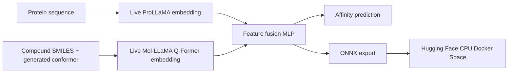

# Protein-Ligand Affinity Prediction Using Molecular and Protein LLMs

Portfolio-ready training, evaluation, ONNX inference, structural exploration, and Hugging Face
deployment for the Kaggle
[Protein-Compound Affinity](https://www.kaggle.com/competitions/protein-compound-affinity/data)
dataset.

The repository supports two experiment tiers:

1. **Reproducible baseline:** 50 deterministic protein/SMILES descriptors for CI and comparison.
2. **Kaggle GPU experiment:** cached frozen embeddings from
   [ProLLaMA](https://huggingface.co/GreatCaptainNemo/ProLLaMA) and
   [Mol-LLaMA](https://huggingface.co/DongkiKim/Mol-Llama-3.1-8B-Instruct), fused by the same
   regression head.

## What This Project Does



- Validates the CSV schema and amino-acid alphabet.
- Profiles protein lengths, SMILES lengths, duplicate pairs, and target distribution.
- Creates deterministic `cold_protein`, `cold_compound`, pair, or random splits.
- Trains with AdamW, validation RMSE checkpointing, and early stopping.
- Reports MAE, RMSE, R-squared, and Pearson correlation.
- Exports the compact regression model to ONNX with dynamic batch size.
- Renders compounds in 2D and generated 3D conformations.
- Renders uploaded experimental/predicted protein PDB structures.
- Deploys to Hugging Face with GitHub Actions only. No AWS services are used.

## Dataset Findings

These values were measured from the supplied `data/train.csv` on June 13, 2026:

| Property | Value |
|---|---:|
| Rows | 263,583 |
| Unique proteins | 2,665 |
| Unique compounds | 196,029 |
| Unique protein-compound pairs | 256,296 |
| Exact duplicate pairs | 7,287 |
| Protein length | 66 to 1,484; mean 582.75 |
| SMILES length | 2 to 100; mean 56.89 |
| Label | 2.0 to 11.0; mean 6.34; standard deviation 1.48 |
| Missing values | 0 |

Because only 2,665 proteins occur across 263,583 rows, a random row split leaks protein identity
across train and test. The default is therefore `cold_protein`.

The CSV itself does not define the target's physical units. Confirm the exact label definition on
the Kaggle competition overview before interpreting predictions as pKd, pKi, or another quantity.

## Models

| Model | Backbone | Domain training and architecture | Role here |
|---|---|---|---|
| Mol-LLaMA | Llama 3.1 8B Instruct | Mol-LLaMA-Instruct; MoleculeSTM 2D encoder, Uni-Mol 3D encoder, blending cross-attention, SciBERT Q-Former, LoRA | Frozen molecular features |
| ProLLaMA | Llama-2-7B | About 13M multi-task protein instruction samples with superfamily information; Protein Vocabulary Pruning | Frozen protein features |
| Fusion regressor | Compact MLP | Trained on this competition dataset | Affinity regression and ONNX deployment |

Read [model research](docs/model_research.md) for paper links, datasets, backbone details, and the
ONNX limitation. Read [experiment protocol](docs/experiment_protocol.md) for training, validation,
testing, and inference rules.

## Repository Layout

```text
.
|-- .github/workflows/       # CI, model publishing, Space deployment
|-- configs/                 # TOML experiment configurations
|-- data/
|   `-- sample_train.csv     # Versioned 512-row representative sample
|-- docs/                    # Model research and experimental protocol
|-- notebooks/
|   `-- kaggle_training.ipynb
|-- scripts/
|   `-- eda.py
|-- space/                   # Gradio Hugging Face Space
|-- src/affinity/            # Data, features, model, train, evaluate, ONNX
|-- tests/
|-- MODEL_CARD.md
`-- pyproject.toml
```

The 172 MB full CSV is ignored by Git. Only the representative sample is committed.

## Local Quick Start

```bash
python -m venv .venv
source .venv/bin/activate             # Windows: .venv\Scripts\activate
pip install -e ".[dev,onnx,analysis]"

affinity-profile --data data/sample_train.csv
affinity-train --config configs/baseline.toml
affinity-export-onnx --artifacts artifacts/baseline
```

The baseline is only a fast comparison. For the actual LLM pipeline, install the LLM dependencies,
clone the official Mol-LLaMA repository, extract both caches, train, and export:

```bash
pip install -e ".[llm,onnx]"
git clone https://github.com/DongkiKim95/Mol-LLaMA external/Mol-LLaMA

python -m affinity.llm_embeddings \
  --data data/train.csv \
  --column protein_sequence \
  --model-id GreatCaptainNemo/ProLLaMA \
  --output artifacts/features/prollama_embeddings.npz \
  --max-length 1536

affinity-mol-embeddings \
  --data data/train.csv \
  --official-repo external/Mol-LLaMA \
  --output artifacts/features/mol_llama_embeddings.npz

# Update configs/kaggle_llm.toml paths for the local machine first.
affinity-train --config configs/kaggle_llm.toml
affinity-export-onnx --artifacts artifacts/llm_fusion

affinity-predict \
  --artifacts artifacts/llm_fusion \
  --prollama-onnx artifacts/onnx/prollama \
  --mol-llama-onnx artifacts/onnx/mol_llama \
  --protein "MAVMKNYLLPILVLFLAYYYYSTNEE" \
  --smiles "CC(=O)O"
```

Inference runs three ONNX Runtime CPU sessions. The ProLLaMA graph must expose
`last_hidden_state`; a text-generation graph that exposes only `logits` is not compatible with the
mean-pooled embedding used during training.

## Export The Three ONNX Models

### 1. ProLLaMA

The included manual exporter loads the causal model, selects its bare Llama decoder, excludes the
language-model head, and exports `last_hidden_state` with dynamic batch and sequence dimensions:

```bash
affinity-export-protein-onnx \
  --model-id GreatCaptainNemo/ProLLaMA \
  --output artifacts/onnx/prollama \
  --dtype float32
```

It saves weights as external ONNX data when supported and compares ONNX Runtime output against
PyTorch. To produce INT8 as well:

```bash
affinity-export-protein-onnx \
  --model-id GreatCaptainNemo/ProLLaMA \
  --output artifacts/onnx/prollama \
  --dtype float32 \
  --quantize
```

INT8 conversion requires the float32 source model and substantially more temporary RAM. Convert
without `--quantize` first and confirm parity before attempting quantization.

### 2. Mol-LLaMA molecular encoder

Run this once in Kaggle or another machine that can load the original model:

```bash
affinity-export-mol-onnx \
  --official-repo external/Mol-LLaMA \
  --output artifacts/onnx/mol_llama \
  --quantize
```

This exports the architecture actually used for molecular embeddings:
MoleculeSTM + Uni-Mol + blending module + Q-Former. It does not export the unused Llama text
decoder. The output is `mean_qformer_query_tokens`, matching training.

The exporter rewrites PyG's duplicate-index message aggregation as a standard ONNX incidence
matrix multiplication. It then checks the rewrite against the official encoder and ONNX Runtime
against PyTorch before accepting the model.

The export directory contains:

- `mol_llama_encoder.onnx`
- `mol_llama_encoder_int8.onnx` when `--quantize` is used
- `unimol_dictionary.json`
- `export_metadata.json`

### 3. Affinity head

For exact training/inference parity, build the training caches with the converted ONNX encoders:

```bash
affinity-extract-onnx \
  --data data/train.csv \
  --prollama-onnx artifacts/onnx/prollama \
  --mol-llama-onnx artifacts/onnx/mol_llama \
  --protein-output artifacts/features/prollama_embeddings.npz \
  --molecule-output artifacts/features/mol_llama_embeddings.npz
```

Then train and export the third model:

```bash
affinity-train --config configs/kaggle_llm.toml
affinity-export-onnx --artifacts artifacts/llm_fusion
```

Create a different representative sample from the full CSV:

```bash
affinity-profile \
  --data data/train.csv \
  --sample-rows 512 \
  --output data/sample_train.csv
```

Create EDA outputs:

```bash
python scripts/eda.py --data data/train.csv --output artifacts/eda
```

## Kaggle Training

Use [kaggle_training.ipynb](notebooks/kaggle_training.ipynb) with a GPU accelerator.

1. Add the competition dataset and this GitHub repository as Kaggle inputs.
2. Enable internet only while downloading gated model weights, if competition rules allow it.
3. Add `HF_TOKEN` as a Kaggle secret and accept the Meta Llama model license.
4. Run the descriptor baseline first.
5. Convert ProLLaMA and Mol-LLaMA to ONNX.
6. Run `affinity-extract-onnx` once per unique protein and compound.
7. Point `configs/kaggle_llm.toml` at those exact ONNX-generated caches.
8. Train and export the affinity head as the third ONNX model.

Full end-to-end fine-tuning of both 7B/8B models is unnecessary and unlikely to fit a standard
Kaggle GPU. Freeze the backbones, cache embeddings, and train only the fusion head. LoRA on a
single backbone can be a later ablation.

## Hugging Face Deployment

Create:

- A Hugging Face model repository containing `model.onnx`, `normalization.npz`, and
  `metadata.json`.
- A Hugging Face Docker Space using CPU hardware.
- GitHub secret `HF_TOKEN`.
- GitHub variables `HF_MODEL_ID` and `HF_SPACE_ID`.
- Space variable `AFFINITY_MODEL_REPO` pointing to the regression model repository.
- Space variable `PROLLAMA_ONNX_REPO` pointing to the ProLLaMA feature-extraction ONNX repository.
- Space variable `MOL_LLAMA_ONNX_REPO` pointing to the Mol-LLaMA encoder ONNX repository.

After Kaggle training, place `model.onnx`, `normalization.npz`, and `metadata.json` in
`release/model/` and commit that release bundle. Run `Publish ONNX Model`, then
`Deploy Hugging Face Space`.

The Space initializes three ONNX Runtime sessions and uses no PyTorch model at inference. A
quantized ProLLaMA 7B graph is still several gigabytes and CPU inference can be slow; free Space
RAM and startup limits may still be the practical constraint. No AWS setup is required.

## 3D Scope

- **Molecule:** RDKit generates and optimizes a conformer from SMILES for interactive viewing.
- **Protein:** upload a PDB file from an experiment or a separate structure predictor such as
  AlphaFold/ESMFold. The amino-acid sequence alone contains no explicit atomic coordinates.
- **Complex:** this project does not claim to predict a protein-ligand binding pose. That requires a
  docking or complex-structure model and should be evaluated separately.

## Responsible Use

This is a research and portfolio project. Predictions are not experimental measurements, medical
advice, or evidence that a compound is safe or effective.
