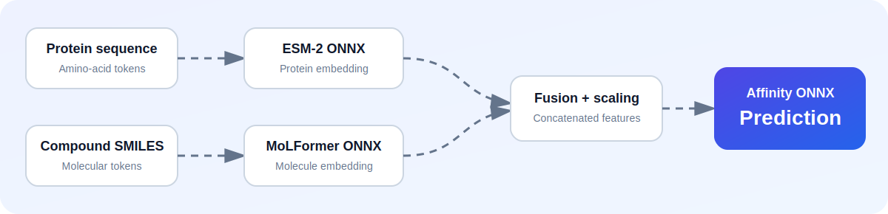
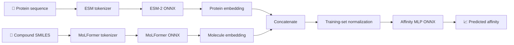
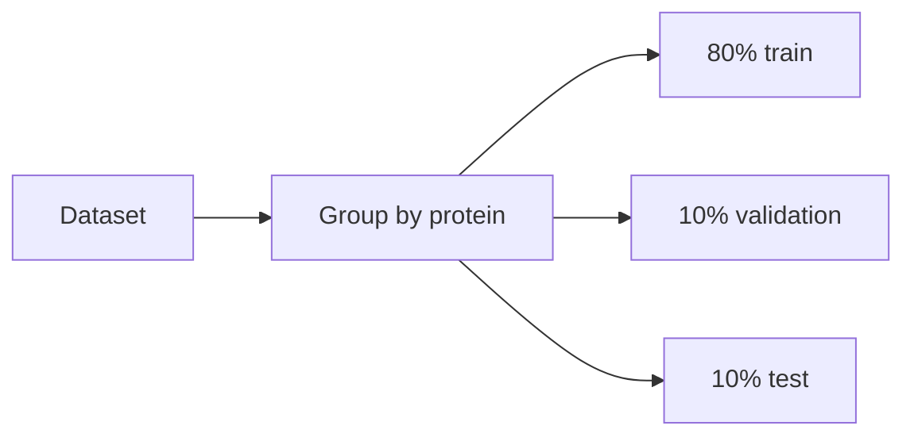

<div align="center">

# 🧬 Protein-Compound Affinity Prediction

### Structure-free affinity prediction with protein and molecular language models

[](https://www.python.org/)
[](https://onnxruntime.ai/)
[](https://huggingface.co/spaces/IAmKarthik/protein-compound-affinity)
[](https://www.apache.org/licenses/LICENSE-2.0)

**Protein sequence + compound SMILES → frozen encoder embeddings → affinity prediction**

[🚀 Live Demo](https://huggingface.co/spaces/IAmKarthik/protein-compound-affinity)
·
[📊 Kaggle Dataset](https://www.kaggle.com/competitions/protein-compound-affinity/data)
·
[🤗 Hugging Face Profile](https://huggingface.co/IAmKarthik)
·
[📓 Notebooks](notebooks)

<br>



</div>

## ✨ Overview

This project predicts a continuous protein-compound affinity value without requiring a protein
structure or a docked ligand pose. It combines representations from two pretrained scientific
language models:

- **Protein encoder:** [ESM-2 35M](https://huggingface.co/facebook/esm2_t12_35M_UR50D)
- **Molecule encoder:** [MoLFormer XL 10%](https://huggingface.co/ibm-research/MoLFormer-XL-both-10pct)
- **Prediction head:** a trained multilayer perceptron exported to ONNX

All three models run through ONNX Runtime. The deployed Hugging Face Space does not require
PyTorch, a paid inference endpoint, AWS, or a GPU.

### What the application provides

- ⚡ CPU-based ONNX inference
- 🧬 protein sequence validation and composition analysis
- 🧪 SMILES validation and molecular descriptors
- 🖼️ server-rendered 2D molecule structures
- 🔬 generated molecule conformer projections
- 🧱 optional PDB backbone visualization
- 🧫 four one-click protein-compound examples
- 📦 reproducible Colab/Kaggle notebook workflow

> [!NOTE]
> The affinity value uses the target scale of the Kaggle training data. It must not be interpreted
> as a universal binding constant unless the dataset definition explicitly establishes that unit.

## 🚀 Try It

Open the live application:

### [Protein-Compound Affinity Explorer](https://huggingface.co/spaces/IAmKarthik/protein-compound-affinity)

1. Paste a protein amino-acid sequence.
2. Paste a compound SMILES string.
3. Select **Predict affinity and render inputs**.
4. Review the predicted score, molecule views, and protein/molecule descriptors.

The first request can take longer because the Space downloads and initializes three ONNX models.
Later requests reuse the cached sessions.

## 🏗️ Architecture



### Default encoder profile

| Component | Model | Backbone | Representation |
|---|---|---|---|
| Protein | [`facebook/esm2_t12_35M_UR50D`](https://huggingface.co/facebook/esm2_t12_35M_UR50D) | 12-layer bidirectional Transformer, approximately 35M parameters | Mean final hidden state over valid residue tokens |
| Molecule | [`ibm-research/MoLFormer-XL-both-10pct`](https://huggingface.co/ibm-research/MoLFormer-XL-both-10pct) | Linear-attention Transformer with rotary embeddings, approximately 46.8M parameters | Official pooled SMILES representation |
| Affinity | Project MLP | `1024 → 512 → 128 → 1`, dropout `0.25` | Continuous affinity prediction |

ESM-2 uses masked amino-acid language modeling. MoLFormer uses masked language modeling over
canonicalized SMILES and was pretrained on 10% of ZINC15 plus 10% of PubChem.

## 🤗 Published Artifacts

| Artifact | Hugging Face repository |
|---|---|
| Interactive application | [`IAmKarthik/protein-compound-affinity`](https://huggingface.co/spaces/IAmKarthik/protein-compound-affinity) |
| ESM-2 ONNX encoder | [`IAmKarthik/esm2-affinity-onnx`](https://huggingface.co/IAmKarthik/esm2-affinity-onnx) |
| MoLFormer ONNX encoder | [`IAmKarthik/molformer-affinity-onnx`](https://huggingface.co/IAmKarthik/molformer-affinity-onnx) |
| Affinity head ONNX | [`IAmKarthik/protein-compound-affinity-esm2-molformer-onnx`](https://huggingface.co/IAmKarthik/protein-compound-affinity-esm2-molformer-onnx) |

The affinity model records the expected encoder IDs, pooling rules, maximum lengths, feature
dimensions, normalization values, and dataset split settings. Incompatible encoder/head
combinations are rejected during inference.

## 📁 Repository Structure

```text
.
├── app.py                              # Local Gradio launcher
├── configs/
│   └── colab.toml                     # Training configuration
├── data/
│   └── sample_train.csv               # Small schema/example dataset
├── docs/
│   ├── LINKEDIN_POST.md               # Ready-to-use launch post
│   └── assets/pipeline.svg            # Animated README diagram
├── notebooks/
│   ├── 01_export_llms_to_onnx.ipynb
│   ├── 02_build_embedding_dataset.ipynb
│   └── 03_train_validate_export.ipynb
├── scripts/
│   └── deploy_hf_space.py
├── space/                              # Docker Space application
├── src/affinity/                       # Training, export and inference package
├── tests/
├── MODEL_CARD.md
└── pyproject.toml
```

## 🛠️ Installation

Python 3.11 is recommended.

### Linux, Colab, or Kaggle

```bash
git clone https://github.com/karthikeyanr103/Protein-Ligand-Affinity-Prediction-Using-LLM.git
cd Protein-Ligand-Affinity-Prediction-Using-LLM

python -m venv .venv
source .venv/bin/activate
python -m pip install --upgrade pip
pip install -e ".[export,space,dev]"
```

### Windows PowerShell

```powershell
git clone https://github.com/karthikeyanr103/Protein-Ligand-Affinity-Prediction-Using-LLM.git
Set-Location Protein-Ligand-Affinity-Prediction-Using-LLM

python -m venv .venv
.\.venv\Scripts\Activate.ps1
python -m pip install --upgrade pip
pip install -e ".[export,space,dev]"
```

Use `.[gpu-runtime]` instead of `.[space]` when ONNX Runtime CUDA inference is required.

## 📓 End-to-End Workflow

The notebooks are designed for Google Colab or Kaggle and should be run in order.

### 1. Export ESM-2 and MoLFormer to ONNX

Notebook: [`01_export_llms_to_onnx.ipynb`](notebooks/01_export_llms_to_onnx.ipynb)

Equivalent commands:

```bash
affinity-export-esm2-onnx \
  --model-id facebook/esm2_t12_35M_UR50D \
  --output /content/onnx/esm2 \
  --max-length 1024

affinity-export-molformer-onnx \
  --model-id ibm-research/MoLFormer-XL-both-10pct \
  --output /content/onnx/molformer \
  --max-length 202
```

The exporters:

1. download the original checkpoints and tokenizers;
2. expose pooled embedding outputs;
3. export dynamic-batch ONNX graphs;
4. write large parameters as ONNX external data when needed;
5. compare PyTorch and ONNX outputs before accepting the export;
6. store preprocessing metadata with the model.

Do not upload only `model.onnx`. ONNX external-data files located beside it are part of the model
and are required by ONNX Runtime.

### 2. Extract embeddings

Notebook: [`02_build_embedding_dataset.ipynb`](notebooks/02_build_embedding_dataset.ipynb)

```bash
affinity-extract-onnx \
  --data /content/data/train.csv \
  --protein-onnx /content/onnx/esm2 \
  --molecule-onnx /content/onnx/molformer \
  --protein-encoder esm2 \
  --molecule-encoder molformer \
  --protein-model-id facebook/esm2_t12_35M_UR50D \
  --molecule-model-id ibm-research/MoLFormer-XL-both-10pct \
  --protein-output /content/cache/esm2_embeddings.npz \
  --molecule-output /content/cache/molformer \
  --protein-max-length 1024 \
  --molecule-max-length 202 \
  --protein-batch-size 16 \
  --molecule-batch-size 32 \
  --molecule-shard-size 1000 \
  --device auto
```

`--device auto` checks installed ONNX Runtime providers and selects CUDA when available; otherwise,
it uses CPU. Molecule embeddings are written in resumable shards so interrupted notebook sessions
can continue without recomputing completed shards.

### 3. Create train, validation, and test data

```bash
affinity-prepare-dataset \
  --data /content/data/train.csv \
  --protein-embeddings /content/cache/esm2_embeddings.npz \
  --molecule-embeddings /content/cache/molformer \
  --output /content/embedding_dataset \
  --split-strategy cold_protein \
  --seed 42
```

The default **cold-protein split** assigns each distinct protein to only one split:



This is stricter than a random row split because the test set contains unseen protein sequences.
The CLI also supports `cold_compound`, `pair`, and `random`.

### 4. Train and evaluate the affinity head

Notebook: [`03_train_validate_export.ipynb`](notebooks/03_train_validate_export.ipynb)

```bash
affinity-train --config configs/colab.toml
affinity-evaluate --artifacts /content/artifacts/affinity
```

The training stage:

- fits normalization statistics on training features only;
- trains the fusion MLP;
- tracks validation RMSE;
- applies early stopping;
- restores the best checkpoint;
- evaluates the untouched test split;
- reports MAE, RMSE, R², and Pearson correlation.

### 5. Export the trained affinity model

```bash
affinity-export-onnx \
  --artifacts /content/artifacts/affinity \
  --output /content/artifacts/affinity/model.onnx
```

The final deployable directory must contain:

```text
model.onnx
normalization.npz
metadata.json
```

## 💻 Inference

### Command line

```bash
affinity-predict \
  --protein "MQIFVKTLTGKTITLEVEPSDTIENVKAKIQDKEGIPPDQQRLIFAGKQLEDGRTLSDYNIQKESTLHLVLRLRGG" \
  --smiles "CN1C=NC2=C1C(=O)N(C(=O)N2C)C" \
  --protein-onnx ./models/esm2-affinity-onnx \
  --molecule-onnx ./models/molformer-affinity-onnx \
  --artifacts ./models/protein-compound-affinity-esm2-molformer-onnx \
  --device auto
```

### Local web application

```bash
python app.py \
  --protein-encoder ./models/esm2-affinity-onnx \
  --molecule-encoder ./models/molformer-affinity-onnx \
  --affinity ./models/protein-compound-affinity-esm2-molformer-onnx \
  --host 127.0.0.1 \
  --port 7860
```

Open [http://127.0.0.1:7860](http://127.0.0.1:7860).

## ☁️ Deploy to Hugging Face Spaces

Create a Hugging Face token with write access, then authenticate:

```bash
pip install --upgrade huggingface-hub
hf auth login
```

Alternatively, expose the token through an environment variable:

```bash
export HF_TOKEN=hf_your_write_token
```

PowerShell:

```powershell
$env:HF_TOKEN = "hf_your_write_token"
```

Deploy or update the Docker Space:

```bash
python scripts/deploy_hf_space.py \
  --space IAmKarthik/protein-compound-affinity \
  --protein-repo IAmKarthik/esm2-affinity-onnx \
  --molecule-repo IAmKarthik/molformer-affinity-onnx \
  --affinity-repo IAmKarthik/protein-compound-affinity-esm2-molformer-onnx
```

The script:

1. validates all three model repositories;
2. creates the Docker Space when it does not exist;
3. packages `space/` and `src/affinity/`;
4. configures `PROTEIN_ONNX_REPO`, `MOLECULE_ONNX_REPO`, and `AFFINITY_MODEL_REPO`;
5. sets `ONNX_DEVICE=cpu`;
6. uploads the application and triggers a rebuild.

For private model repositories, provide a separate read-only token:

```bash
export HF_MODEL_TOKEN=hf_read_only_token
```

The deployment write token is not stored in the Space.

## 🧠 Optional Legacy Profile

The repository retains experimental support for:

| Input | Legacy model | Scale |
|---|---|---|
| Protein | [`GreatCaptainNemo/ProLLaMA`](https://huggingface.co/GreatCaptainNemo/ProLLaMA) | Llama-family 7B |
| Molecule | [`DongkiKim/Mol-Llama-3.1-8B-Instruct`](https://huggingface.co/DongkiKim/Mol-Llama-3.1-8B-Instruct) | Llama 3.1 8B with molecular encoders |

These models need substantially more RAM, storage, export time, and ONNX external-data files.
They are retained for experimentation, but the lightweight ESM-2/MoLFormer profile is the default
for reproducible portfolio deployment.

## 🧪 Tests

```bash
pytest
```

The tests cover dataset splitting, embedding-table loading, regression metrics, and Mol-LLaMA
aggregation behavior.

## 🔧 Troubleshooting

| Problem | Resolution |
|---|---|
| ONNX model exceeds 2 GiB | Export to a file path and keep all generated external-data files beside `model.onnx`. |
| ONNX Runtime cannot allocate memory | Use CPU execution, reduce batch size/sequence length, disable the memory arena when appropriate, or choose the lightweight profile. |
| `pthread_setaffinity_np failed` | Set explicit ONNX Runtime intra/inter-op thread counts. This message is usually a container CPU-affinity issue. |
| RDKit reports `libXrender.so.1` missing | Install `libxrender1`, `libxext6`, and `libsm6`; the provided Dockerfile already does this. |
| 3Dmol.js does not load in a Space | The final application uses server-rendered Pillow images and no longer depends on 3Dmol.js or an external JavaScript CDN. |
| Space remains on the setup page | Run `scripts/deploy_hf_space.py` and wait for the Docker build to finish. |
| ESM tokenizer reports `TokenizersBackend` | Use the model-specific `EsmTokenizer`; this is handled by the project runtime. |

## 📚 References

### Dataset

- [Structure-free protein-ligand affinity prediction competition](https://www.kaggle.com/competitions/protein-compound-affinity)
- [Competition data page](https://www.kaggle.com/competitions/protein-compound-affinity/data)

### Models and papers

1. Lin, Z. et al. [Evolutionary-scale prediction of atomic-level protein structure with a language model](https://doi.org/10.1126/science.ade2574). *Science*, 2023.
2. Ross, J. et al. [Large-scale chemical language representations capture molecular structure and properties](https://doi.org/10.1038/s42256-022-00580-7). *Nature Machine Intelligence*, 2022.
3. Lv, L. et al. [ProLLaMA: A Protein Large Language Model for Multi-Task Protein Language Processing](https://arxiv.org/abs/2402.16445), 2024.
4. Kim, D. et al. [Mol-LLaMA: Towards General Understanding of Molecules in Large Molecular Language Model](https://arxiv.org/abs/2502.13449), 2025.

### Software

- [Hugging Face Transformers](https://huggingface.co/docs/transformers/)
- [ONNX](https://onnx.ai/)
- [ONNX Runtime](https://onnxruntime.ai/docs/)
- [RDKit](https://www.rdkit.org/docs/)
- [Gradio](https://www.gradio.app/docs/)
- [RCSB Protein Data Bank](https://www.rcsb.org/)

## ⚠️ Limitations

- This project is a portfolio and research demonstration.
- The model does not predict a binding pose or interaction residues.
- Generated molecular conformers are computational illustrations, not experimental structures.
- Protein 3D rendering requires uploaded or downloaded PDB coordinates.
- Long sequences and SMILES are truncated to the encoder limits.
- Predictions can be unreliable outside the chemical and protein distributions represented by the
  pretrained encoders and affinity dataset.
- Results are not medical, clinical, toxicological, or drug-development advice.
- Experimental validation is required before scientific or commercial use.

## 🙏 Acknowledgements

This project builds on the work of the Kaggle competition organizers, Meta AI's ESM team, IBM
Research's MoLFormer team, the ProLLaMA and Mol-LLaMA authors, Hugging Face, Microsoft ONNX
Runtime, RDKit, Gradio, and the RCSB Protein Data Bank.

## 📄 License

Project code is released under the
[Apache License 2.0](https://www.apache.org/licenses/LICENSE-2.0). Upstream datasets, model
weights, and software packages retain their own licenses and terms of use.

---

<div align="center">

Built by [Karthikeyan R](https://github.com/karthikeyanr103) ·
[Try the live model](https://huggingface.co/spaces/IAmKarthik/protein-compound-affinity)

⭐ If this project is useful, consider starring the repository.

</div>
