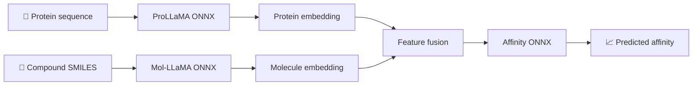
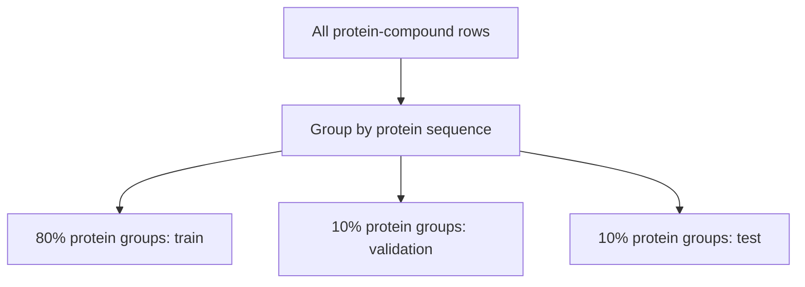
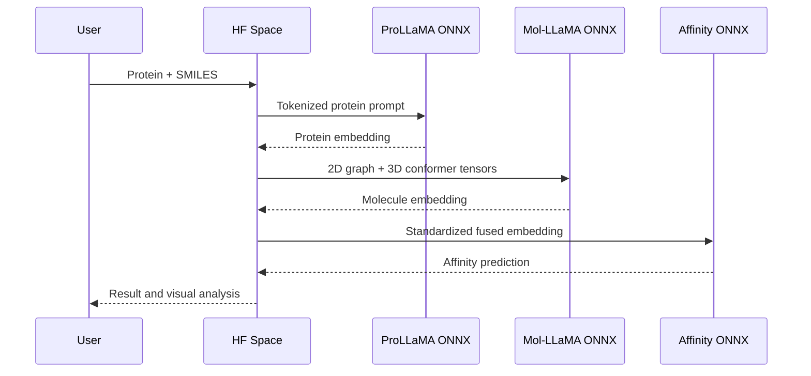

<div align="center">

# 🧬 Protein-Compound Affinity Prediction

### ProLLaMA ONNX + Mol-LLaMA ONNX + Affinity ONNX


Protein-compound affinity prediction using two frozen scientific language-model encoders and a
small trainable regression head.

</div>

---

## 🌟 Project Idea

The project takes two inputs:

- a protein amino-acid sequence;
- a compound represented as a SMILES string.

Each input is converted into an embedding by an ONNX encoder. The embeddings are concatenated and
passed to a regression model that predicts the dataset affinity label.



The final application uses **three ONNX models**. PyTorch is not required during deployment.

## 🧠 Models

| Component | Source model | Representation |
|---|---|---|
| Protein encoder | [GreatCaptainNemo/ProLLaMA](https://huggingface.co/GreatCaptainNemo/ProLLaMA) | Mean-pooled final hidden state |
| Molecule encoder | [DongkiKim/Mol-Llama-3.1-8B-Instruct](https://huggingface.co/DongkiKim/Mol-Llama-3.1-8B-Instruct) | Mean-pooled Q-Former query tokens |
| Affinity model | MLP trained in this repository | One regression value |

Research papers:

- [ProLLaMA: A Protein Large Language Model for Multi-Task Protein Language Processing](https://arxiv.org/abs/2402.16445)
- [Mol-LLaMA: Towards General Understanding of Molecules in Large Molecular Language Model](https://arxiv.org/abs/2502.13449)

Mol-LLaMA contains an 8B Llama decoder, but that decoder is not required for the molecular
embedding. The exported molecular graph contains:

- MoleculeSTM 2D encoder;
- Uni-Mol 3D encoder;
- modality blending module;
- Q-Former.

## 🗂️ Repository

```text
.
|-- app.py                         # Local Gradio application
|-- configs/
|   `-- colab.toml                 # Training configuration example
|-- data/
|   `-- sample_train.csv           # Small test fixture
|-- notebooks/
|   |-- 01_export_llms_to_onnx.ipynb
|   |-- 02_build_embedding_dataset.ipynb
|   `-- 03_train_validate_export.ipynb
|-- space/                         # Hugging Face Docker Space
|-- src/affinity/                  # Export, extraction, training and inference code
|-- tests/
|-- MODEL_CARD.md
`-- pyproject.toml
```

GitHub Actions are intentionally not used. Large ONNX and embedding files are transferred directly
between Colab, Google Drive and Hugging Face.

## 📚 Notebook Workflow

Run the notebooks in numerical order. Each notebook is independent and reads the previous stage
from Hugging Face.

### 1️⃣ Export Both LLM Encoders

Open:

[`01_export_llms_to_onnx.ipynb`](notebooks/01_export_llms_to_onnx.ipynb)

This notebook:

1. installs the project and official Mol-LLaMA code;
2. exports ProLLaMA without its language-model head;
3. exports the Mol-LLaMA molecular encoder;
4. creates INT8 ONNX versions;
5. runs PyTorch-to-ONNX parity checks;
6. runs sample embedding inference;
7. uploads two Hugging Face model repositories.

Edit these values before uploading:

```python
HF_USER = "your-huggingface-username"
PRO_REPO = f"{HF_USER}/prollama-affinity-onnx"
MOL_REPO = f"{HF_USER}/mol-llama-affinity-onnx"
```

Expected repositories:

```text
your-name/prollama-affinity-onnx
your-name/mol-llama-affinity-onnx
```

### 2️⃣ Build and Upload the Embedding Dataset

Open:

[`02_build_embedding_dataset.ipynb`](notebooks/02_build_embedding_dataset.ipynb)

This notebook:

1. downloads both ONNX encoders;
2. validates the source CSV;
3. extracts one embedding for every unique protein;
4. extracts one embedding for every unique molecule;
5. saves molecule embeddings in resumable shards;
6. creates cold-protein train, validation and test splits;
7. uploads a Hugging Face dataset.

The dataset repository contains:

```text
train.csv
validation.csv
test.csv
train_features.npz
validation_features.npz
test_features.npz
dataset_metadata.json
```

CSV files contain sequences, SMILES and labels. Embeddings are stored in compressed NPZ matrices.
Putting thousands of floating-point values inside CSV cells would be much larger and slower.

Expected dataset repository:

```text
your-name/protein-compound-affinity-embeddings
```

Notebook 2 automatically checks for an NVIDIA GPU. When one is present it installs
`onnxruntime-gpu`; otherwise it installs the CPU runtime. Before extraction begins, the command
prints the physical GPU, available ONNX Runtime providers and the selected device:

```text
Physical GPU: NVIDIA A100-SXM4-40GB
ONNX Runtime providers: ['CUDAExecutionProvider', 'CPUExecutionProvider']
Selected ONNX device: CUDA GPU
```

Device selection defaults to `--device auto`. Use `--device cpu` to force CPU or
`--device cuda` to require CUDA and fail early when the CUDA provider is unavailable.

### 3️⃣ Train, Validate and Export

Open:

[`03_train_validate_export.ipynb`](notebooks/03_train_validate_export.ipynb)

This notebook:

1. downloads the fixed embedding dataset;
2. standardizes features using training statistics only;
3. trains the fusion MLP;
4. selects the best validation-RMSE checkpoint;
5. evaluates the held-out test split;
6. exports the trained head to ONNX;
7. verifies PyTorch/ONNX parity;
8. uploads the final model repository.

Reported metrics:

- MAE;
- RMSE;
- R²;
- Pearson correlation.

Expected model repository:

```text
your-name/protein-compound-affinity-onnx
```

## 🔀 Data Splitting

The source dataset contains many repeated proteins. A random row split would place the same protein
in training and testing and produce an overly optimistic result.

The default split is **cold protein**:



A protein sequence belongs to exactly one split.

## 💻 Colab Runtime

The notebooks target Python 3.11.

Use a Colab TPU runtime with a high-memory host when available. The TPU cores are not used by ONNX
export or ONNX Runtime. TPU mode is useful here because the VM may provide more host RAM.

Approximate weight sizes:

| Model | FP32 | INT8 |
|---|---:|---:|
| ProLLaMA 7B | ~28 GB | ~7 GB |
| Full Mol-LLaMA 8B | ~32 GB | ~8 GB |

The Mol-LLaMA export excludes the 8B text decoder, so its final molecular ONNX graph is much
smaller than the full checkpoint.

Peak export memory is higher than final file size because PyTorch weights, the ONNX graph and
temporary conversion data may exist at the same time.

## 🧪 Local Web Inference

Download these three Hugging Face model repositories:

```text
prollama-affinity-onnx/
mol-llama-affinity-onnx/
protein-compound-affinity-onnx/
```

Install the runtime:

```bash
python -m venv .venv

# Linux/macOS
source .venv/bin/activate

# Windows PowerShell
.venv\Scripts\Activate.ps1

pip install -e ".[space]"
```

Start the local application:

```bash
python app.py \
  --prollama ./models/prollama-affinity-onnx \
  --mol-llama ./models/mol-llama-affinity-onnx \
  --affinity ./models/protein-compound-affinity-onnx
```

Windows PowerShell:

```powershell
python app.py `
  --prollama .\models\prollama-affinity-onnx `
  --mol-llama .\models\mol-llama-affinity-onnx `
  --affinity .\models\protein-compound-affinity-onnx
```

Open:

```text
http://127.0.0.1:7860
```

The UI provides:

- affinity prediction;
- protein sequence summary;
- molecule descriptors;
- molecule 2D rendering;
- deterministic molecule 3D conformer rendering;
- uploaded PDB protein rendering.

## 🤗 Hugging Face Space Deployment

Create a new **Docker Space**.

Upload the contents of `space/` to the Space repository:

```bash
huggingface-cli upload YOUR_NAME/YOUR_SPACE ./space . \
  --repo-type space
```

Add these Space variables:

```text
PROLLAMA_ONNX_REPO=your-name/prollama-affinity-onnx
MOL_LLAMA_ONNX_REPO=your-name/mol-llama-affinity-onnx
AFFINITY_MODEL_REPO=your-name/protein-compound-affinity-onnx
```

The Space defaults to INT8 encoder files:

```text
PROLLAMA_ONNX_VARIANT=int8
MOL_LLAMA_ONNX_VARIANT=int8
```

If a repository only contains float32:

```text
PROLLAMA_ONNX_VARIANT=fp32
MOL_LLAMA_ONNX_VARIANT=fp32
```

Add `HF_TOKEN` as a Space secret when any model repository is private.



## ⚠️ Deployment Limits

ONNX removes the PyTorch runtime requirement, but it does not make a 7B model small. ProLLaMA INT8
is still several gigabytes. Free Hugging Face CPU Spaces may be limited by:

- RAM;
- repository download time;
- disk size;
- cold-start time;
- CPU inference latency.

The application queues one prediction at a time to avoid loading duplicate model sessions.

## 🔬 Reproducibility

The workflow records:

- model repository IDs;
- protein prompt and maximum length;
- embedding pooling rules;
- deterministic conformer seed;
- Uni-Mol dictionary;
- split strategy and seed;
- normalization mean and standard deviation;
- final test metrics.

Both LLM embedding caches are created with the same INT8 ONNX graphs used during deployment.

## 🛡️ Scope

This is a portfolio and research project.

- A generated conformer is not an experimental structure.
- The model does not predict a protein-ligand binding pose.
- The affinity output is not clinical evidence.
- Results should not be used as a replacement for laboratory validation.
